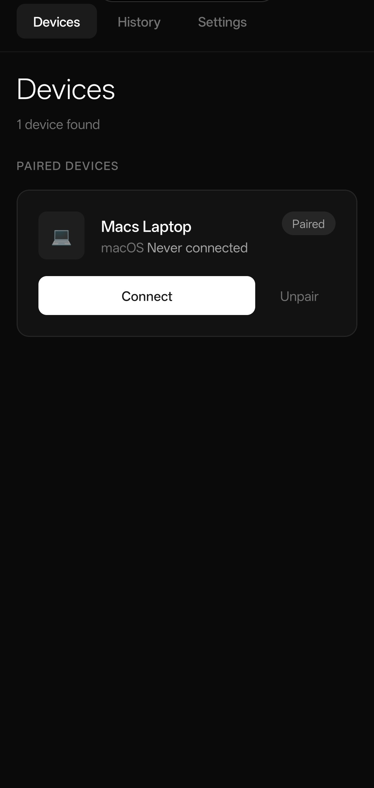
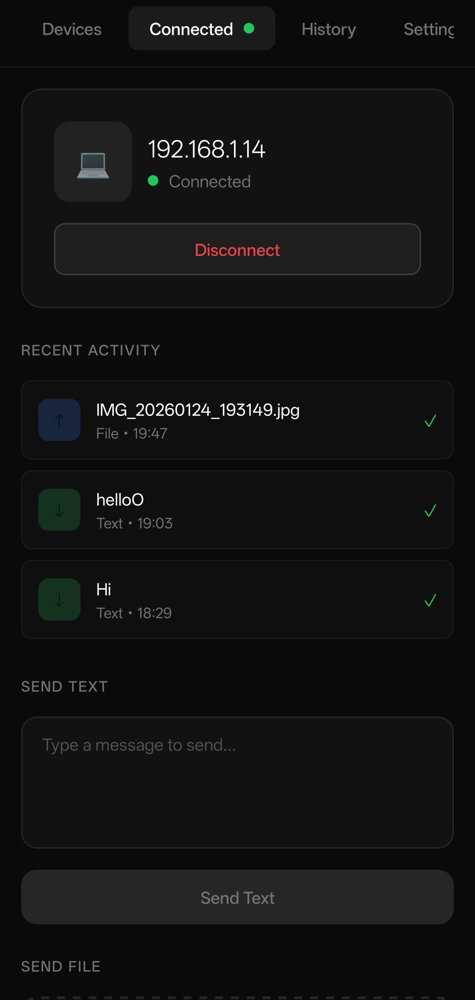
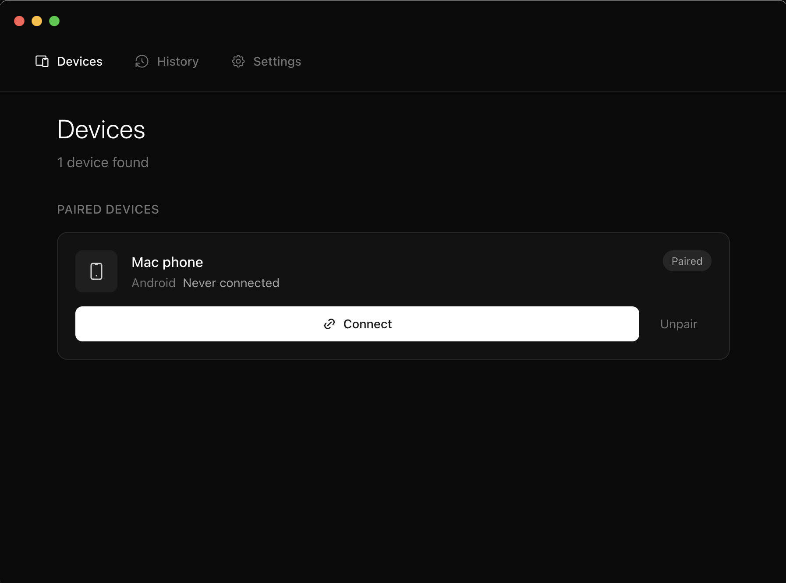
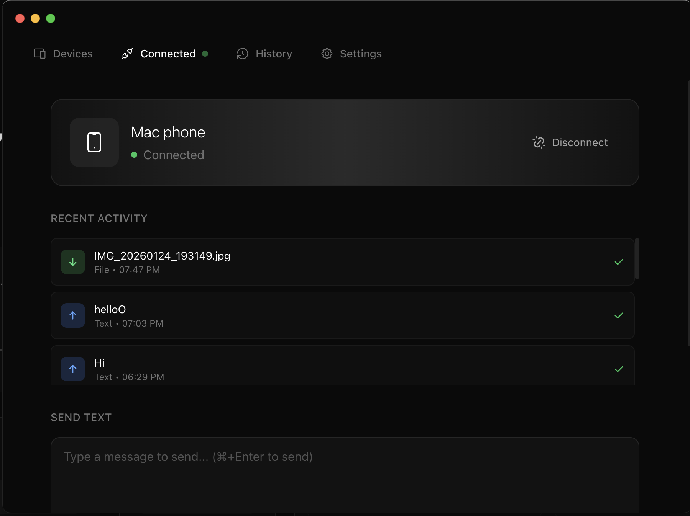
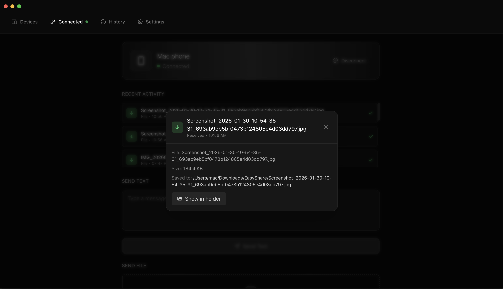

# EasyShare

**Privacy-First Local Network File & Text Sharing Between Android and macOS**

EasyShare is a cross-platform application that enables seamless file and text sharing between Android and macOS devices over your local network. No cloud servers, no accounts, no internet required—just secure, direct device-to-device communication.

---

## Screenshots

### Android App

<p align="center">
  
  &nbsp;&nbsp;&nbsp;
  
</p>

<p align="center">
  <em>Left: Discover and connect to paired devices &nbsp;|&nbsp; Right: Send files and text while connected</em>
</p>

### macOS App

<p align="center">
  
  &nbsp;&nbsp;
  
</p>

<p align="center">
  
</p>

<p align="center">
  <em>Device pairing, real-time file transfers, and transfer history</em>
</p>

---

## Table of Contents

- [Screenshots](#screenshots)
- [Why EasyShare?](#why-easyshare)
- [Features](#features)
- [Privacy & Security](#privacy--security)
- [Architecture Overview](#architecture-overview)
- [Requirements](#requirements)
- [Installation](#installation)
  - [From Pre-built Releases](#from-pre-built-releases)
  - [Building From Source](#building-from-source)
- [Running in Development](#running-in-development)
- [Building for Production](#building-for-production)
- [Configuration](#configuration)
- [How It Works](#how-it-works)
- [Project Structure](#project-structure)
- [Troubleshooting](#troubleshooting)
- [Contributing](#contributing)
- [License](#license)

---

## Why EasyShare?

Most file-sharing solutions require cloud accounts, internet connectivity, or third-party servers that can access your data. EasyShare takes a fundamentally different approach:

| Traditional Solutions | EasyShare |
|-----------------------|-----------|
| Requires internet | Works completely offline |
| Data passes through cloud servers | Direct device-to-device only |
| Requires account creation | No accounts, no sign-ups |
| Company can access your files | Zero knowledge—only you have your data |
| Subscription fees | Free and open source |
| Proprietary protocols | Transparent, auditable code |

**EasyShare is designed for users who value their privacy and want full control over their data.**

---

## Features

### Fast Transfers for Any File Size
- **HTTP-Accelerated Large Files** — Files over 5MB transfer via HTTP streaming, bypassing bridge overhead for native-speed throughput
- **Handles Massive Files** — Send 400MB, 1GB, or larger files without memory issues thanks to streaming I/O
- **Small Files Stay Simple** — Files under 5MB use efficient chunk-based transfer over the existing TCP connection
- **Real-Time Progress** — Per-file progress bars with percentage, speed, and duration tracking
- **Integrity Verified** — SHA-512 streaming checksums verify every byte without loading files into memory

### Instant Device Discovery
- **Zero-Configuration Networking** — Devices find each other automatically using mDNS/Bonjour with no manual IP entry
- **Periodic Re-Scanning** — Automatic discovery refresh every 15 seconds catches devices that join the network late
- **Works Instantly** — Devices typically appear within 1-2 seconds of launching the app

### Multi-File Transfers with Queue
- **Batch File Sending** — Select multiple files at once from the file picker or drag and drop on desktop
- **Visual Transfer Queue** — See every file's status: queued, transferring with progress bar, completed, or failed
- **Sequential Reliability** — Files transfer one at a time to avoid overwhelming the connection, with the queue showing overall progress

### Secure Pairing & Encryption
- **Passphrase-Based Pairing** — Simple passphrase entry on both devices establishes a shared secret
- **Challenge-Response Protocol** — Passphrases are never sent over the network; only cryptographic proofs
- **End-to-End Encryption** — All data encrypted using NaCl secretbox (XSalsa20-Poly1305)
- **Remember Paired Devices** — Reconnect instantly to previously paired devices without re-pairing

### Privacy & Offline-First Design
- **100% Local Network** — All communication stays on your local network; nothing ever leaves your premises
- **No Internet Required** — Works in airplane mode, isolated networks, or anywhere without internet
- **No Cloud Services** — Zero dependency on any external servers or services
- **No Accounts** — No registration, no email, no personal information collected
- **No Telemetry** — No analytics, no tracking, no usage data collection

### Connection Resilience
- **Auto-Reconnect** — If the connection drops (e.g., Android backgrounding during file selection), the app automatically reconnects when returning to foreground
- **Keepalive System** — Application-level ping/pong with 2-minute timeout, paused during transfers and when the app is backgrounded
- **Connection Retry** — Initial connections retry up to 3 times with backoff for reliability on flaky networks

### User Experience
- **Modern Dark UI** — Beautiful, minimal interface with smooth animations on both platforms
- **Cross-Platform** — Native apps for both Android and macOS with shared TypeScript core
- **Transfer History** — View recent transfers with speed, duration, and file details
- **Auto-Accept Option** — Optionally auto-accept transfers from trusted devices
- **Configurable Save Location** — Choose where received files are saved

---

## Privacy & Security

EasyShare was built with security as a foundational principle, not an afterthought.

### Encryption

All communication between devices is encrypted using **NaCl secretbox (XSalsa20-Poly1305)**, a modern authenticated encryption algorithm that provides both confidentiality and integrity protection.

```
┌─────────────────────────────────────────────────────────────┐
│                    ENCRYPTION DETAILS                       │
├─────────────────────────────────────────────────────────────┤
│  Algorithm:     XSalsa20-Poly1305 (NaCl secretbox)          │
│  Key Derivation: PBKDF2 with 100,000 iterations             │
│  Salt:          Device ID (unique per device pair)          │
│  Nonce:         Randomly generated per connection           │
│  Key Size:      256-bit                                     │
└─────────────────────────────────────────────────────────────┘
```

### Pairing Security

When you pair two devices:
1. You enter a shared passphrase on both devices
2. Each device derives a cryptographic key using PBKDF2 (100,000 iterations)
3. A challenge-response protocol verifies both devices have the same key
4. The shared secret is stored locally (never transmitted)
5. **Passphrases are never sent over the network**

### File Integrity

- Small files are split into 64KB chunks for reliable transmission
- Large files stream via HTTP at native speed with progress tracking
- SHA-512 streaming checksums verify integrity without loading entire files into memory
- Any corruption is detected and the transfer fails safely

### Local Storage

| Platform | Storage Method | Security |
|----------|---------------|----------|
| macOS | electron-store | OS-level encryption |
| Android | AsyncStorage | Platform secure storage |

**What's stored locally:**
- Device name and ID
- Paired device information (encrypted shared secrets)
- Transfer history (last 100 transfers)
- App preferences

**What's never stored:**
- Passphrases (only used for key derivation)
- File contents after transfer
- Any personal information

### Network Security

- **Local network only** — Cannot communicate over the internet
- **Dynamic ports** — Each connection uses a randomly assigned port
- **No listening on fixed ports** — Reduces attack surface
- **Connection timeout** — Idle connections are terminated

---

## Architecture Overview

EasyShare uses a monorepo architecture with three packages:

```
┌─────────────────────────────────────────────────────────────┐
│                     ARCHITECTURE                            │
├─────────────────────────────────────────────────────────────┤
│                                                             │
│   ┌─────────────────┐         ┌─────────────────┐          │
│   │   macOS App     │◄───────►│   Android App   │          │
│   │   (Electron)    │  Local  │ (React Native)  │          │
│   │                 │ Network │                 │          │
│   └────────┬────────┘         └────────┬────────┘          │
│            │                           │                    │
│            └───────────┬───────────────┘                    │
│                        │                                    │
│              ┌─────────▼─────────┐                          │
│              │   Shared Core     │                          │
│              │   (TypeScript)    │                          │
│              │                   │                          │
│              │ • Crypto          │                          │
│              │ • Protocol        │                          │
│              │ • Discovery       │                          │
│              │ • Pairing         │                          │
│              │ • Transfer        │                          │
│              └───────────────────┘                          │
│                                                             │
└─────────────────────────────────────────────────────────────┘
```

### Technology Stack

| Component | Technology |
|-----------|------------|
| **Shared Core** | TypeScript 5.3, tweetnacl (encryption), js-sha512 (streaming checksums), tsup |
| **Desktop (macOS)** | Electron 33, React 18, Tailwind CSS, Framer Motion |
| **Mobile (Android)** | React Native 0.73, NativeWind, react-native-tcp-socket |
| **Build Tools** | Vite, Metro, electron-builder |
| **Discovery** | bonjour-service (macOS), react-native-zeroconf (Android) |

---

## Requirements

### General Requirements

| Requirement | Version |
|-------------|---------|
| Node.js | 18.0.0 or higher |
| npm | 9.0.0 or higher |
| Git | Any recent version |

### macOS Development

| Requirement | Details |
|-------------|---------|
| macOS | 10.15 (Catalina) or higher |
| Xcode Command Line Tools | `xcode-select --install` |
| Xcode (optional) | For code signing and notarization |

### Android Development

| Requirement | Details |
|-------------|---------|
| Android Studio | Latest stable version |
| JDK | Version 17 |
| Android SDK | API Level 24+ (Android 7.0+) |
| Android device or emulator | With USB debugging enabled |

---

## Installation

### From Pre-built Releases

*(Coming soon — check the Releases page)*

### Building From Source

#### Step 1: Clone the Repository

```bash
git clone https://github.com/yourusername/easy-android-to-mac.git
cd easy-android-to-mac
```

#### Step 2: Install Dependencies

```bash
# Install all dependencies for the monorepo
npm install
```

This will install dependencies for:
- Root workspace
- `packages/shared` — TypeScript core library
- `packages/desktop` — Electron app
- `packages/mobile` — React Native app

#### Step 3: Build the Shared Core

The shared core must be built before running either platform:

```bash
npm run build:shared
```

This compiles the TypeScript core library that both platforms depend on.

#### Step 4: Continue to Platform-Specific Instructions

- [Running the Desktop App](#desktop-macos)
- [Running the Mobile App](#mobile-android)

---

## Running in Development

### Desktop (macOS)

Start the Electron app in development mode with hot reload:

```bash
npm run dev:desktop
```

This will:
1. Start the Vite development server for the renderer process
2. Launch the Electron app
3. Enable hot module replacement for rapid development

The app window will open automatically. Changes to React components will hot reload instantly.

**Development shortcuts:**
- `Cmd + Option + I` — Open Developer Tools
- `Cmd + R` — Force reload the app

### Mobile (Android)

Running the Android app requires two terminal windows:

**Terminal 1 — Start Metro Bundler:**

```bash
npm run dev:mobile
```

This starts the Metro bundler on port 8082.

**Terminal 2 — Run on Device/Emulator:**

```bash
cd packages/mobile
npm run android
```

This will:
1. Build the Android app
2. Install it on your connected device or running emulator
3. Launch the app

**Development notes:**
- Ensure USB debugging is enabled on your Android device
- For emulator: Start it from Android Studio before running the command
- Shake the device to open the React Native developer menu
- Press `R` twice in the Metro terminal to reload the app

**Connecting a physical device:**

```bash
# List connected devices
adb devices

# If device shows as "unauthorized", check your phone for the USB debugging prompt
```

---

## Building for Production

### Desktop (macOS)

#### Build the Application

```bash
npm run build:desktop
```

This creates an optimized production build in `packages/desktop/dist/`.

#### Package as DMG/ZIP

```bash
cd packages/desktop
npm run package
```

This creates distributable files in `packages/desktop/release/`:
- `.dmg` — Disk image for macOS distribution
- `.zip` — Compressed archive

**Build configuration** is in `packages/desktop/package.json` under the `build` key:

```json
{
  "build": {
    "appId": "com.easyshare.desktop",
    "productName": "EasyShare",
    "mac": {
      "category": "public.app-category.utilities",
      "target": ["dmg", "zip"]
    }
  }
}
```

#### Code Signing (Optional)

For distribution outside the App Store, you'll need to sign and notarize the app:

```bash
# Set environment variables
export APPLE_ID="your-apple-id@email.com"
export APPLE_ID_PASSWORD="app-specific-password"
export APPLE_TEAM_ID="your-team-id"

# Build with signing
cd packages/desktop
npm run package
```

### Mobile (Android)

#### Build Release APK

```bash
cd packages/mobile
npm run build:android
```

The APK will be created at:
```
packages/mobile/android/app/build/outputs/apk/release/app-release.apk
```

#### Signing the APK

For production releases, you need to sign the APK:

1. **Generate a keystore** (one-time):
   ```bash
   keytool -genkeypair -v -storetype PKCS12 -keystore easyshare.keystore -alias easyshare -keyalg RSA -keysize 2048 -validity 10000
   ```

2. **Configure signing** in `packages/mobile/android/gradle.properties`:
   ```properties
   MYAPP_UPLOAD_STORE_FILE=easyshare.keystore
   MYAPP_UPLOAD_KEY_ALIAS=easyshare
   MYAPP_UPLOAD_STORE_PASSWORD=your-store-password
   MYAPP_UPLOAD_KEY_PASSWORD=your-key-password
   ```

3. **Build signed APK**:
   ```bash
   cd packages/mobile/android
   ./gradlew assembleRelease
   ```

---

## Configuration

### Application Settings

Both platforms store settings locally. Available settings include:

| Setting | Description | Default |
|---------|-------------|---------|
| Device Name | How your device appears to others | System hostname |
| Auto-Accept | Automatically accept from paired devices | Off |
| Save Directory | Where received files are saved | Downloads folder |
| Notifications | Show transfer notifications | On |

### Build Configuration

#### Shared Package (`packages/shared/tsconfig.json`)

```json
{
  "compilerOptions": {
    "target": "ES2022",
    "module": "ESNext",
    "strict": true,
    "declaration": true,
    "outDir": "./dist"
  }
}
```

#### Desktop Package (`packages/desktop/electron.vite.config.ts`)

Key configurations:
- Path aliases for clean imports
- Separate configs for main, preload, and renderer
- Tailwind CSS processing

#### Mobile Package (`packages/mobile/metro.config.js`)

Key configurations:
- Monorepo workspace support
- Custom port (8082) to avoid conflicts
- Path resolution for shared package

### Network Configuration

EasyShare uses the following network resources:

| Resource | Purpose | Configurable |
|----------|---------|--------------|
| mDNS (UDP 5353) | Device discovery | No |
| TCP (dynamic port) | Control messages, small file transfer | No |
| HTTP (dynamic port) | Large file transfer (>= 5MB) | No |
| Service name: `_easyshare._tcp` | mDNS service type | No |

**Firewall requirements:**
- Allow incoming/outgoing UDP on port 5353 (mDNS)
- Allow incoming/outgoing TCP on ephemeral ports (49152-65535)

---

## How It Works

### Device Discovery

```
┌─────────────┐                              ┌─────────────┐
│   Device A  │                              │   Device B  │
└──────┬──────┘                              └──────┬──────┘
       │                                            │
       │  1. Broadcast mDNS: "_easyshare._tcp"      │
       │────────────────────────────────────────────►
       │                                            │
       │  2. mDNS Response: "DeviceB @ 192.168.1.5" │
       │◄────────────────────────────────────────────
       │                                            │
       │  3. Devices now visible to each other      │
       ▼                                            ▼
```

Both apps advertise themselves on the local network using mDNS (Bonjour on macOS, NSD on Android) with service type `_easyshare._tcp`. Each service includes:
- Device ID (unique identifier)
- Device name
- Platform (macos/android)
- App version

### Pairing Protocol

```
┌─────────────┐                              ┌─────────────┐
│   Device A  │                              │   Device B  │
└──────┬──────┘                              └──────┬──────┘
       │                                            │
       │  User enters passphrase on both devices    │
       │                                            │
       │  1. PAIR_REQUEST (Device A info)           │
       │────────────────────────────────────────────►
       │                                            │
       │  2. PAIR_CHALLENGE (random challenge)      │
       │◄────────────────────────────────────────────
       │                                            │
       │     Both derive key: PBKDF2(passphrase,    │
       │     deviceId, 100000 iterations)           │
       │                                            │
       │  3. PAIR_RESPONSE (signed challenge)       │
       │────────────────────────────────────────────►
       │                                            │
       │     Device B verifies signature            │
       │                                            │
       │  4. PAIR_CONFIRM (success + counter-proof) │
       │◄────────────────────────────────────────────
       │                                            │
       │  Devices are now paired!                   │
       │  Shared secret stored locally              │
       ▼                                            ▼
```

### Communication Protocol

After pairing:
- TCP socket connection on dynamically assigned port
- Messages are length-prefixed JSON with binary data for files
- All communication encrypted with NaCl secretbox (XSalsa20-Poly1305)
- Maximum message size: 10MB

### File Transfer Protocol

EasyShare uses two transfer modes, chosen automatically based on file size:

**Small files (< 5MB) — Chunk-based over TCP:**

```
┌─────────────┐                              ┌─────────────┐
│   Sender    │                              │   Receiver  │
└──────┬──────┘                              └──────┬──────┘
       │                                            │
       │  1. FILE_REQUEST (name, size, checksum)    │
       │────────────────────────────────────────────►
       │                                            │
       │  2. FILE_ACCEPT                            │
       │◄────────────────────────────────────────────
       │                                            │
       │  3. FILE_CHUNK (64KB chunks)               │
       │────────────────────────────────────────────►
       │         ... repeat for all chunks ...      │
       │                                            │
       │  4. FILE_COMPLETE (checksum)               │
       │────────────────────────────────────────────►
       ▼                                            ▼
```

**Large files (>= 5MB) — HTTP streaming:**

```
┌─────────────┐                              ┌─────────────┐
│   Sender    │                              │   Receiver  │
└──────┬──────┘                              └──────┬──────┘
       │                                            │
       │  1. FILE_REQUEST (name, size, httpUrl)     │
       │────────────────────────────────────────────►
       │                                            │
       │  2. FILE_ACCEPT (uploadUrl)                │
       │◄────────────────────────────────────────────
       │                                            │
       │  3. HTTP transfer (native speed)           │
       │────────── file data via HTTP ─────────────►
       │                                            │
       │  4. FILE_ACK (success/failure)             │
       │◄────────────────────────────────────────────
       ▼                                            ▼
```

The HTTP path avoids the React Native bridge bottleneck for large files, achieving native transfer speeds. Both paths verify file integrity — small files use full SHA-512 checksums, large files verify by file size to avoid reading the entire file back through the bridge.

---

## Project Structure

```
easy-android-to-mac/
├── packages/
│   ├── shared/                      # Shared TypeScript core
│   │   ├── src/
│   │   │   ├── types/               # TypeScript type definitions
│   │   │   │   └── index.ts         # Device, Message, Transfer types
│   │   │   ├── crypto/              # Cryptographic utilities
│   │   │   │   ├── encryption.ts    # XSalsa20-Poly1305 encrypt/decrypt
│   │   │   │   ├── keys.ts          # PBKDF2 key derivation
│   │   │   │   └── checksum.ts      # SHA-512 file checksums
│   │   │   ├── discovery/           # mDNS protocol helpers
│   │   │   │   └── index.ts         # Service type, TXT records
│   │   │   ├── pairing/             # Device pairing logic
│   │   │   │   ├── state.ts         # Pairing state machine
│   │   │   │   └── challenge.ts     # Challenge-response protocol
│   │   │   ├── transfer/            # File/text transfer
│   │   │   │   ├── chunker.ts       # File chunking logic
│   │   │   │   └── progress.ts      # Progress tracking
│   │   │   └── protocol/            # Message protocol
│   │   │       ├── messages.ts      # Message types and handlers
│   │   │       └── framing.ts       # Length-prefixed framing
│   │   ├── package.json
│   │   └── tsconfig.json
│   │
│   ├── desktop/                     # Electron macOS app
│   │   ├── src/
│   │   │   ├── main/                # Main process (Node.js)
│   │   │   │   ├── index.ts         # App entry point
│   │   │   │   ├── connection.ts    # TCP connection handling
│   │   │   │   ├── discovery.ts     # Bonjour/mDNS integration
│   │   │   │   └── storage.ts       # Persistent storage
│   │   │   ├── preload/             # Preload scripts (IPC bridge)
│   │   │   │   └── index.ts         # Secure API exposure
│   │   │   └── renderer/            # Renderer process (React)
│   │   │       ├── App.tsx          # Root component
│   │   │       ├── components/      # UI components
│   │   │       ├── hooks/           # React hooks
│   │   │       └── styles/          # Tailwind CSS
│   │   ├── electron.vite.config.ts  # Build configuration
│   │   ├── tailwind.config.js       # Tailwind theme
│   │   └── package.json
│   │
│   └── mobile/                      # React Native Android app
│       ├── src/
│       │   ├── screens/             # App screens
│       │   │   ├── DiscoveryScreen.tsx
│       │   │   ├── ConnectedScreen.tsx
│       │   │   ├── HistoryScreen.tsx
│       │   │   └── SettingsScreen.tsx
│       │   ├── components/          # Shared components
│       │   ├── hooks/               # Custom hooks
│       │   │   ├── useDiscovery.ts  # mDNS discovery
│       │   │   ├── useConnection.ts # TCP connection
│       │   │   └── useStorage.ts    # AsyncStorage
│       │   └── native/              # Native module bridges
│       ├── android/                 # Android native code
│       ├── App.tsx                  # Root component
│       ├── metro.config.js          # Metro bundler config
│       └── package.json
│
├── package.json                     # Monorepo workspace config
├── tsconfig.base.json               # Shared TypeScript config
└── README.md                        # This file
```

---

## Troubleshooting

### General Issues

#### Devices not discovering each other

**Symptoms:** Devices on the same network don't appear in the discovery list.

**Solutions:**
1. **Check network:** Ensure both devices are on the same Wi-Fi network (not using cellular or different VLANs)
2. **Firewall:** Allow mDNS traffic (UDP port 5353) in your firewall
3. **Router isolation:** Disable "AP Isolation" or "Client Isolation" in router settings
4. **Restart discovery:** Close and reopen the app on both devices

#### Pairing fails

**Symptoms:** Devices see each other but pairing doesn't complete.

**Solutions:**
1. **Passphrase mismatch:** Ensure the exact same passphrase is entered on both devices (case-sensitive)
2. **Timing:** Enter the passphrase on both devices within 30 seconds
3. **Retry:** Cancel and try pairing again

#### File transfer stuck or fails

**Symptoms:** Transfer starts but doesn't complete or shows an error.

**Solutions:**
1. **File size:** For very large files, ensure stable network connection
2. **Disk space:** Ensure receiving device has enough storage space
3. **Firewall:** Allow TCP traffic on ephemeral ports (49152-65535)
4. **Retry:** Cancel and attempt the transfer again

### macOS-Specific Issues

#### App won't open (unidentified developer)

**Solution:** Right-click the app, select "Open", then click "Open" in the dialog.

Or via Terminal:
```bash
xattr -cr /Applications/EasyShare.app
```

#### mDNS not working

**Solution:** Ensure Bonjour is enabled:
```bash
# Check if mDNSResponder is running
sudo launchctl list | grep mDNS
```

### Android-Specific Issues

#### App crashes on startup

**Solutions:**
1. **Clear app data:** Settings → Apps → EasyShare → Clear Data
2. **Reinstall:** Uninstall and reinstall the app
3. **Check Android version:** Requires Android 7.0 (API 24) or higher

#### Cannot find devices

**Solutions:**
1. **Location permission:** Grant location permission (required for Wi-Fi scanning on Android 10+)
2. **Wi-Fi:** Ensure Wi-Fi is enabled and connected
3. **Battery optimization:** Disable battery optimization for EasyShare

### Development Issues

#### `npm install` fails

**Solutions:**
```bash
# Clear npm cache
npm cache clean --force

# Delete node_modules and lock file
rm -rf node_modules package-lock.json
rm -rf packages/*/node_modules

# Reinstall
npm install
```

#### Shared package not found

**Solutions:**
```bash
# Rebuild the shared package
npm run build:shared

# If still failing, check the symlink
ls -la packages/desktop/node_modules/@easyshare
```

#### Metro bundler port conflict

**Solution:** The mobile package uses port 8082 by default. If it conflicts:
```bash
# Kill process on port 8082
lsof -ti:8082 | xargs kill -9

# Or use a different port
npx react-native start --port 8083
```

#### Android build fails with Java errors

**Solutions:**
```bash
# Ensure JDK 17 is installed and active
java -version  # Should show version 17

# Set JAVA_HOME if needed
export JAVA_HOME=$(/usr/libexec/java_home -v 17)

# Clean Android build
cd packages/mobile/android
./gradlew clean
```

---

## Contributing

Contributions are welcome! Please follow these guidelines:

### Development Setup

1. Fork the repository
2. Clone your fork
3. Create a feature branch: `git checkout -b feature/your-feature`
4. Make your changes
5. Run type checking: `npm run typecheck`
6. Commit with clear messages
7. Push and create a Pull Request

### Code Style

- TypeScript strict mode is enforced
- Use functional React components with hooks
- Follow existing code patterns and naming conventions
- Add types for all function parameters and returns

### Testing Changes

Before submitting:
```bash
# Type check all packages
npm run typecheck

# Build all packages
npm run build

# Test on both platforms if possible
npm run dev:desktop
npm run dev:mobile
```

### Security Considerations

If you discover a security vulnerability:
1. **Do not** open a public issue
2. Email the maintainers directly with details
3. Allow time for a fix before public disclosure

---

## Frequently Asked Questions

### Is my data sent to any servers?

**No.** EasyShare is completely local. Your files and text are transferred directly between your devices over your local network. No data ever leaves your network or touches any external servers.

### Does it work without internet?

**Yes.** EasyShare only requires a local network connection. You can use it:
- In airplane mode (with Wi-Fi enabled)
- On networks without internet access
- On isolated private networks

### How secure is the encryption?

EasyShare uses XSalsa20-Poly1305, the same encryption used by Signal, WhatsApp, and other security-focused applications. Keys are derived using PBKDF2 with 100,000 iterations, making brute-force attacks impractical.

### Can someone on my network intercept my files?

The encryption protects against passive interception. Even if someone captures the network traffic, they cannot decrypt it without knowing your pairing passphrase.

### Why do I need to enter a passphrase?

The passphrase is used to derive the encryption key. It ensures that only devices where you've entered the same passphrase can communicate. This prevents unauthorized devices from connecting to you.

### Can I use this on iOS or Windows?

Currently, EasyShare supports macOS and Android. iOS and Windows versions may be added in the future—contributions are welcome!

---

## License

MIT

---

## Acknowledgments

- [tweetnacl](https://tweetnacl.js.org/) — Cryptographic library
- [Electron](https://www.electronjs.org/) — Desktop framework
- [React Native](https://reactnative.dev/) — Mobile framework
- [Tailwind CSS](https://tailwindcss.com/) — Styling
- [bonjour-service](https://github.com/onlxltd/bonjour-service) — mDNS for Node.js

---

<p align="center">
  <strong>Built with privacy in mind.</strong><br>
  Your data. Your devices. Your network. Nothing else.
</p>
